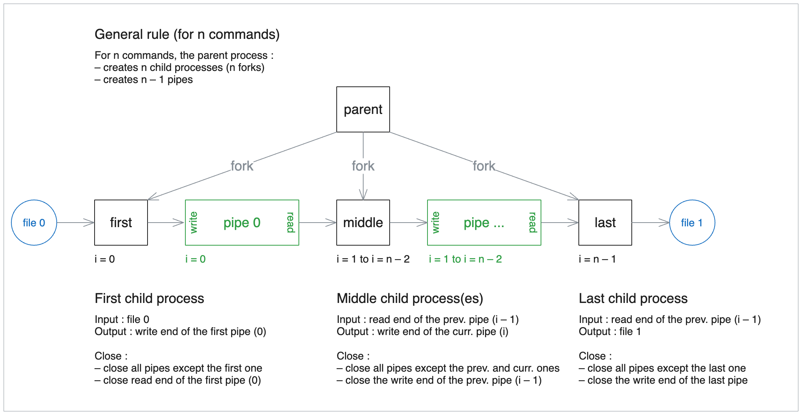
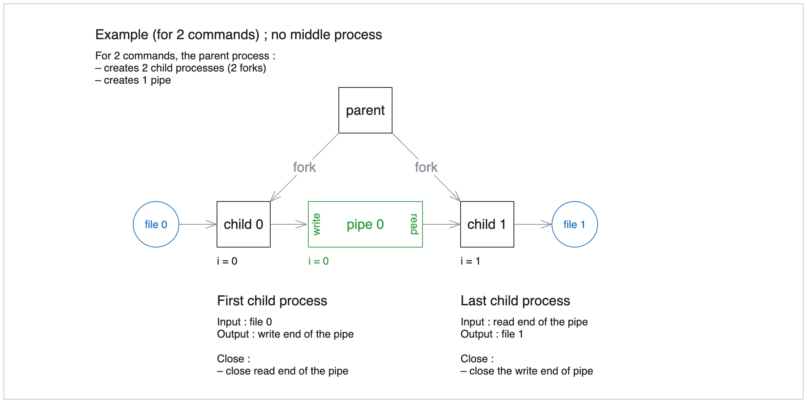

# 42-pipex

## About
Reproduces the behaviour of the shell piping which allows the output of one command to serve as the input to another.

This implementation enables users to apply a series of commands to an input file and generate an output file.

### Principle

The core of this project lies in creating `n` child processes for `n` commands, connected by `n – 1` pipes.

#### How it works

1. An input file is read by the first command.
2. The output of each command is piped as input to the next command in the sequence.
3. The final command's output is written to the specified output file.




## Usage
```bash
# With pipex
./pipex input cmd0 cmd1 ... cmdn output

# Bash equivalent
cmd0 < input | cmd1 | cmd2 ... | cmdn > output
```

### Examples
#### Alphabetical sorting and filtering
Sorts alphabetically the content of the input  file and outputs the first three lines.
```bash
# With pipex
./pipex input sort "head -n 3" > output

# Bash equivalent
sort < input | head -n 3 > output
```

#### Filtering and counting lines
Filters lines containing the word "example" from the input file and counts the number of such lines.


```bash
# With pipex
./pipex input "grep example" "wc -l" output

# Bash equivalent
grep example < input | wc -l > output
````

<!--
## Getting started
### Prerequisites
### Installation
-->

<!--## Usage-->
<!--## Roadmap-->
<!--## Contributing-->
<!--## License-->
<!--## Contact-->
<!--## Aknowledgements-->

---
*42 is a coding school that emphasizes on project-based and peer-to-peer learning.*

*The project complies with the 42 norm. The latest norm can be found on the [42 repository](https://github.com/42School/norminette/tree/master/pdf)*.